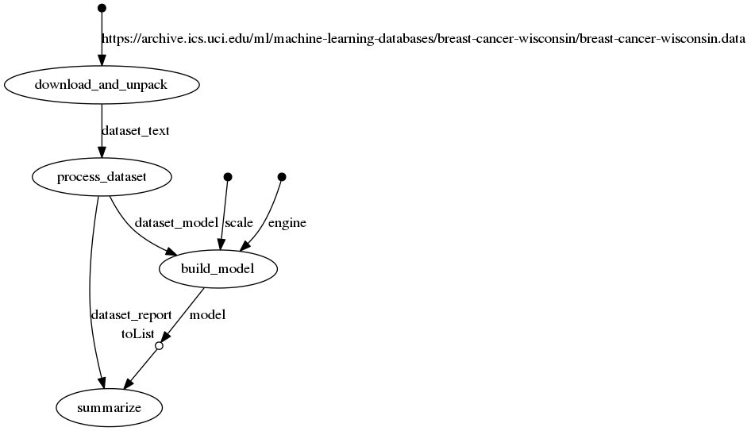

## toy-sklearn-nf-pipeline

A simple example to explore how one might use [nextflow](https://www.nextflow.io/) to implement a 'combinatorial dag' like commonly arises in sklearn work, as discussed in [Breck (2008)](http://www.aclweb.org/anthology/W/W08/W08-0503.pdf).

DockerHub image is [here](https://hub.docker.com/r/mmacpherson/toy-sklearn-nf-pipeline/).

To run:

    nextflow run mmacpherson/toy-sklearn-nf-pipeline

